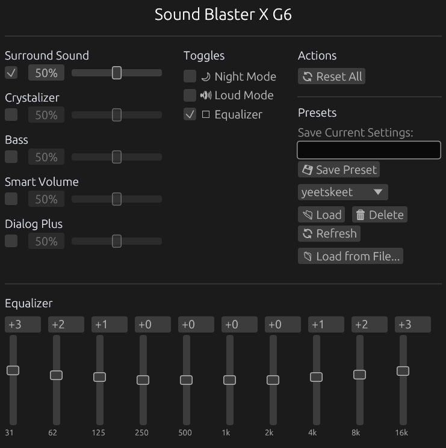

# Sound Blaster X G6 Control for Linux

A native Linux GUI application to control the **Creative Sound Blaster X G6** USB DAC/Amp. Built with Rust using egui for the interface and hidapi for USB HID communication.



## Supported Features

Toggles and sliders work for:

- Surround Sound
- Crystalizer
- Bass
- Smart Volume
- Dialog Plus
- Night Mode
- 10-Band Equalizer (31Hz – 16kHz, ±12 dB)

## Requirements

- Linux (tested on x86_64)
- Sound Blaster X G6 connected via USB
- udev rules for HID access (see below)

### udev Rules

To access the device without root privileges, create a udev rule:

```bash
sudo tee /etc/udev/rules.d/99-soundblaster-g6.rules << 'EOF'
# Creative Sound Blaster X G6
SUBSYSTEM=="hidraw", ATTRS{idVendor}=="041e", ATTRS{idProduct}=="3256", MODE="0666"
EOF

sudo udevadm control --reload-rules
sudo udevadm trigger
```

You may need to unplug and replug the device after adding the rule.

## Installation

### Building from Source

Requires Rust 2024 edition (nightly) and system dependencies for hidapi and egui.

```bash
# Clone the repository
git clone https://github.com/YOUR_USERNAME/linuxblaster_control.git
cd linuxblaster_control

# Build release binary
cargo build --release

# Run
./target/release/blaster_x_g6_control
```

### System Dependencies

On Debian/Ubuntu:

```bash
sudo apt install libudev-dev libhidapi-dev libwayland-dev libxkbcommon-dev libgl1-mesa-dev
```

On Fedora:

```bash
sudo dnf install systemd-devel hidapi-devel wayland-devel libxkbcommon-devel mesa-libGL-devel
```

On Arch:

```bash
sudo pacman -S hidapi wayland libxkbcommon mesa
```

### Nix

A `flake.nix` is provided for Nix users:

```bash
nix develop  # Enter development shell
cargo build --release
```

## Usage

Simply run the application while the Sound Blaster X G6 is connected:

```bash
./blaster_x_g6_control
```

If the device is not detected, the UI will display a warning but remain functional for previewing the interface.

## ⚠️ Development Status

**This project is in active development and should be considered experimental.**

### Current Limitations

- **No config persistence** — Settings are not saved between sessions
- **No import/export** — Cannot save or load presets or EQ profiles
- **No state reading** — Cannot read current device state, only send commands
- **Limited testing** — Tested only on the developer's hardware

### Known Issues

- The USB protocol was reverse-engineered and may not cover all device features
- Some features available in the Windows Sound Blaster Command software are not yet implemented

## Technical Details

- **Vendor ID:** `0x041e` (Creative Technology)
- **Product ID:** `0x3256` (Sound Blaster X G6)
- **Interface:** 4 (HID control interface)

Communication uses 65-byte HID reports with a custom protocol consisting of DATA and COMMIT packets.

## Contributing

Contributions are welcome! If you have a Sound Blaster X G6 and want to help:

- Report bugs or missing features
- Help reverse-engineer additional functionality
- Improve the UI/UX
- Add config file support

## Acknowledgments

This project builds upon the USB protocol research from the [soundblaster-x-g6-cli](https://github.com/nils-skowasch/soundblaster-x-g6-cli) project by Nils Skowasch, which provided initial USB packet captures and protocol documentation. Additional reverse engineering (including the 10-band EQ protocol) was done for this project.

## License

MIT License — see [LICENSE](LICENSE) for details.
