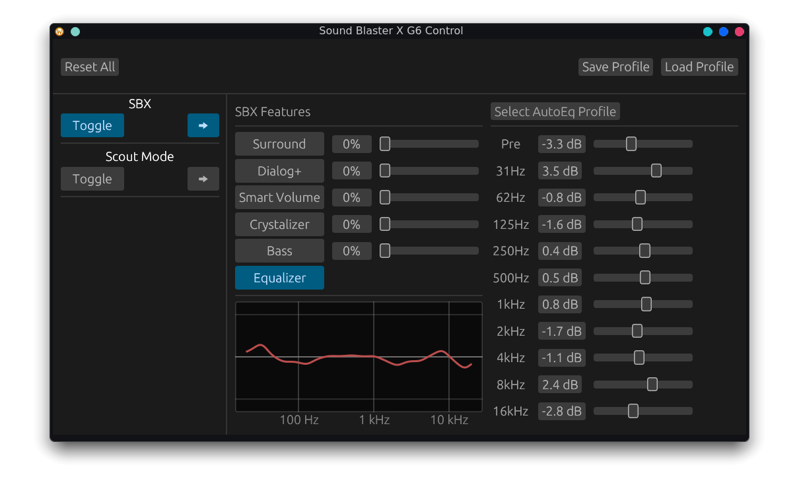

# Linuxblaster Control 
(because it sounds mildly funny) 

A native Linux GUI application to control the **Creative Sound BlasterX G6** USB DAC/Amp, with full [AutoEq](https://github.com/jaakkopasanen/AutoEq) integration. 



## v2.1 - now with State Reading 

The Software can now read out the State of the Device, instead of having to track it internally.  
Note that the G6 has two internal settings profiles, one for Headphones and one for Speakers. The App will auto-refresh its state from device on Output switching.  

Do note tho: Profile Loading is currently still a little buggy when a Slider was saved with a non-zero Value and its corresponding Toggle turned off. 

## Supported Features

- **State Reading**
- **Profiles**
	- Saving & Loading (mostly working)
	- Profile Save Location
- **SBX**
	- Surround Sound
	- Dialog+
	- Smart Volume 
	- Crystalizer 
	- Bass 
	- Equalizer 
		- PreAmp
		- 10-band EQ
- **Playback**
	- Output Toggle 
- **Scout Mode** 

## Not-Yet-Implemented Features

- **SBX** 
  - Smart Volume Sub-Features
    - Night Mode & Loud Mode
  - Equalizer Sub-Features 
    - SBC Eq Presets 
- **Playback**
  - Direct Mode (not planned) 
  - Filter
  - Audio Quality 
- **Recording**
  - _Everything_
- **Decoder** 
  - "Normal", "Full", and "Night" Selection
- **Mixer** 
  - Output
    - Speakers 
  - Monitoring 
    - _Everything_ 
  - Recording
    - _Everything_ 
- **Lighting**
  - _Everything_

## Presets

Presets are stored as JSON files in `~/.local/share/linuxblaster/presets/`. 
Presets from before v2.1 will have to be remade, the old format is no longer compatible. 

> [!IMPORTANT]
> The preset format is custom to this application and is **not compatible** with official Creative Sound Blaster Command profiles (.json or .xml) from Windows.

## Requirements

- Linux (tested on x86_64)
- Sound Blaster X G6 connected via USB
- udev rules for HID access (see below)

### udev Rules

To access the device without root privileges, create a udev rule:

``` js (not actually js, just makes for a good highlighting)
SUBSYSTEM=="hidraw", ATTRS{idVendor}=="041e", ATTRS{idProduct}=="3256", MODE="0666"
```

You may need to unplug and replug the device after adding the rule.

## Installation

### Nix

Add to your NixOS configuration:

```nix
{
  inputs.linuxblaster_control.url = "github:RizeCrime/linuxblaster_control";

  outputs = { self, nixpkgs, linuxblaster_control, ... }: {
    nixosConfigurations.yourhostname = nixpkgs.lib.nixosSystem {
      modules = [
        linuxblaster_control.nixosModules.default
        {
          hardware.soundblaster-g6.enable = true;
        }
      ];
    };
  };
}
```

or 
```bash
# Run without installing
nix run github:RizeCrime/linuxblaster_control

# Install to user profile
nix profile install github:RizeCrime/linuxblaster_control

# Build locally
git clone https://github.com/RizeCrime/linuxblaster_control.git
cd linuxblaster_control
nix build
```

### Building from Source

```bash
# Clone the repository
git clone https://github.com/RizeCrime/linuxblaster_control.git
cd linuxblaster_control

# Build release binary
cargo build --release

# Run
./target/release/linuxblaster_control
```

### System Dependencies

You will need the following packages at a minimum:
- hidapi 
- udev

### Nix Development Shell

A `flake.nix` is provided for Nix users who want to develop:

```bash
nix develop  # Enter development shell with all dependencies
cargo build --release
```

## Usage

Simply run the application while the Sound Blaster X G6 is connected:

```bash
./linuxblaster_command
```

If the device is not detected, the application won't start. 
In that case, Launch it from a cli and check the logs (if I configured them correctly, which I'm not too sure about). 

## ⚠️ Development Status

**This project is in active development and should be considered experimental.**

### Current Limitations

- **Limited testing** — Tested only on the developer's hardware.
- The USB protocol was reverse-engineered and may not cover all device features.
- Some features available in the Windows Sound Blaster Command software are not yet implemented.

## Technical Details

- **Vendor ID:** `0x041e` (Creative Technology)
- **Product ID:** `0x3256` (Sound Blaster X G6)
- **Interface:** 4 (HID control interface)

Communication uses 65-byte HID reports with a custom protocol consisting of DATA and COMMIT packets.

Find the details in [UsbProtocol](UsbProtocol.md).  

## Contributing

Contributions are welcome! If you have a Sound Blaster X G6 and want to help:

- Report bugs or missing features
- Help reverse-engineer additional functionality

## Acknowledgments

~~This project builds upon the USB protocol research from the [soundblaster-x-g6-cli](https://github.com/nils-skowasch/soundblaster-x-g6-cli) project by Nils Skowasch, which provided initial USB packet captures and protocol documentation. Additional reverse engineering (including the 10-band EQ protocol) was done for this project.~~  
The initial versions of this project were based on the [soundblaster-x-g6-cli](https://github.com/nils-skowasch/soundblaster-x-g6-cli) project. However, it turns out that this work was misleadingly incomplete. What was thought to be a Commit Push from the Host was actually the Device reporting back a queried value, just as an example. I have done a bunch of extra reverse engineering to figure out the actual full protocol (see the sniffer directory), at least I _think_ that I've got the full picture this time; but that's also what I thought before, so who knows /shrug. 

## AI Disclaimer 

With v2 I can proudly say that almost all Code was written by me (In v1 the GUI was written by AI (and you could tell)), and AI only filled out match arms and enums for me. 
I also use AI liberally to beautify anything user-facing (including this README and most other .md files).  
Oh and the math for the EQ curve visualizer was also done by AI because I find it boring; I make computers do the math for me for a reason. 

## License

MIT License — see [LICENSE](LICENSE) for details.
